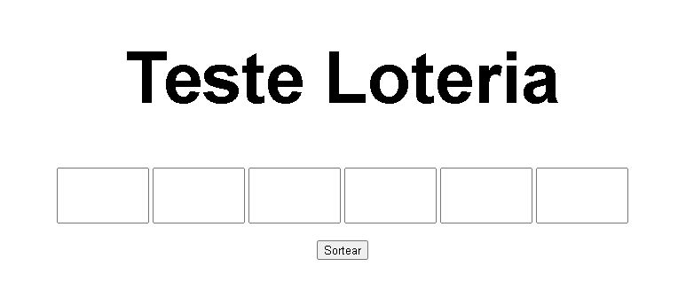
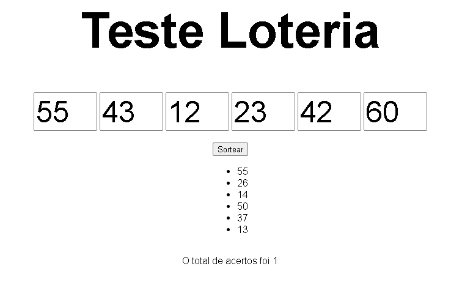

# Simulador de Loteria

O projeto é um simulador onde podemos sortear números como se fosse a lotérica, o usuário pode digitar seis números com duas casa decimais

**Não é um simulador oficial, apenas para aprendizagem.**

## Tecnologias utilizadas
1.**HTML:** é uma Linguagem de Marcação de Hipertexto
2.**Javascript:**JavaScript é uma linguagem de programação que permite implementar funcionalidades mais complexas em páginas web.
3.**CSS:**Folhas de Estilo em Cascata
4. ~~**JQuery:**~~ Não foi utilizado

## Funções Principais
Aqui será apresentado as duas funções principais do simulador.

### Sorteio de números
Nesta função os números são sorteados aleatoriamente

```
function sortearNumeros() {
  numSort = [];
  let sort;
  for (var i = 0; i < 6; i++) {
    do {
      sort = Math.ceil(Math.random() * 60);
      sort = (sort == 0) ? 1 : sort;
    }while(numSort.includes(sort));
    numSort.push(sort);
  }
}
```

### Lendo os números digitados
Ler os números digitado pelo usuário

```
function addToList(num, pos) {
  if (num.length == 2) {
    if (numEsco.includes(num)) {
      alert("Numero Escolhido Anteriormente!! Digite outro numero!")
    }else if(parseInt(num) > 60){
      alert("O numero digitado não pode ser maior que 60");
    }else{
      numEsco[pos -1] = num;
    }
  }
}
```

## Como rodar o código

> Simplesmente baixe o código e abra o arquivo no seu **_index.html_** no seu navegador

##Fazendo uma tabela

| Tabela   |      São      |  Legais |
|----------|:-------------:|------:|
| col 1 is |  left-aligned | $1600 |
| col 2 is |    centered   |   $12 |
| col 3 is | right-aligned |    $1 |

## Imagens da tabela

Tela de abertura

Números digitados e sorteados

## Links

[Google] (https://www.google.com.br/)

[W3Schools] (https://www.w3schools.com/)
